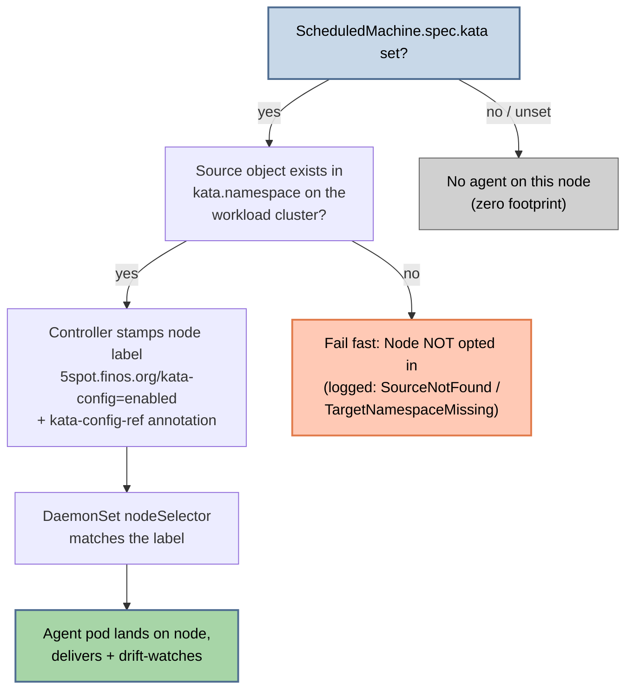

# Kata Config Delivery (Per-Node containerd Drop-In)

**Status:** Shipped — CRD field (`spec.kata`), controller-side Node opt-in, node-side `5spot-kata-config-agent` DaemonSet (host write + `nsenter` k0s-service restart), and agent metrics are all live. Decisions: ADR [0002](https://github.com/finos/5-spot/blob/main/docs/adr/0002-kata-config-delivery-via-spec-kata.md) (contract + resolution) and ADR [0003](https://github.com/finos/5-spot/blob/main/docs/adr/0003-in-pod-host-service-restart-via-nsenter.md) (host write + restart).

---

## Why kata config delivery exists

5-Spot's target deployment runs on k0s-provisioned worker nodes where containerd consumes drop-in config from `/etc/k0s/containerd.d/`. Operators running [Kata Containers](https://katacontainers.io/) need a specific containerd drop-in (e.g. `kata-containers.toml`) to land on a particular worker node the moment that node reaches Ready — and then need the k0s service bounced so containerd picks it up.

Doing this by hand (SSH to the node, write the file, `systemctl restart k0sworker`) breaks the GitOps model: the config's source of truth should be a `ConfigMap`/`Secret` in the cluster, and a node that joins at 9 AM on its schedule should get its drop-in with zero operator action.

Kata config delivery is the orthogonal sibling of [emergency reclaim](./emergency-reclaim.md): the same opt-in DaemonSet shape, the same `5spot.finos.org/*` label namespace, the same "controller signals, node agent acts" split.

**This is config delivery, not a Kata install.** The kata binaries (`/opt/kata`) remain [kata-deploy](https://github.com/kata-containers/kata-containers/tree/main/tools/packaging/kata-deploy)'s job. One `spec.kata` → one file on the host.

---

## The delivery chain

```mermaid
flowchart LR
    A["ScheduledMachine<br/>spec.kata set"]
    B["5-Spot Controller<br/>(Active phase, node Ready)"]
    C["Resolve source ConfigMap/Secret<br/>on the workload cluster<br/>(read-only existence check)"]
    D["PATCH Node:<br/>label 5spot.finos.org/kata-config=enabled<br/>+ kata-config-ref annotation"]
    E["DaemonSet nodeSelector matches<br/>→ agent pod lands on node"]
    F["Agent GETs source object,<br/>atomically writes the fixed path<br/>/etc/k0s/containerd.d/kata.toml"]
    G["Record applied content hash<br/>annotation on own Node"]
    H["nsenter -t 1 …<br/>systemctl restart k0sworker.service"]
    I["containerd reloads drop-in<br/>(agent pod bounced + rescheduled)"]

    A --> B --> C --> D --> E --> F --> G --> H --> I

    style A fill:#f9d5a7,stroke:#e17b4b,stroke-width:2px,color:#000
    style B fill:#c8d8e8,stroke:#4f6d91,stroke-width:2px,color:#000
    style F fill:#c8d8e8,stroke:#4f6d91,stroke-width:2px,color:#000
    style H fill:#ffc9b5,stroke:#e17b4b,stroke-width:2px,color:#000
```



Each hop's responsibility stays narrow:

- The **controller** performs *no host writes* — it resolves the source object on the workload cluster (read-only) and stamps the Node opt-in label + reference annotation. That's its whole job (ADR 0002).
- The **agent** owns the host write **and** the service restart end-to-end (ADR 0003). No controller-side restart orchestration, no Jobs.

## The annotation contract

The single load-bearing surface between controller and agent is a pair of Node annotations:

| Annotation | Written by | Value |
|---|---|---|
| `5spot.finos.org/kata-config-ref` | Controller | Compact JSON: `{namespace, kind, name, key, restartService}` — which workload object to read |
| `5spot.finos.org/kata-config-applied` | Agent | Bare SHA-256 of the content it last restarted for (or `absent` after tear-down) — the restart-loop guard |

Deliberately, **neither annotation carries a host path** (ADR 0005): the write destination is the compile-time constant `/etc/k0s/containerd.d/kata.toml`, so neither a CR author nor anyone holding `patch nodes` can steer where the privileged agent writes or unlinks.

The agent reads the source object **via the kube API**, not a mounted ConfigMap volume — a cluster-wide DaemonSet cannot template a `configMap.name` volume per replica (ADR 0002). This is also why the reference travels as an annotation on the Node the agent already watches: no per-node manifest stamping required.

The contract is pinned by `tests/integration_kata_config.rs`: the controller's annotation builder must parse field-for-field through the agent's parser.

---

## Sequence of operations

```mermaid
sequenceDiagram
    autonumber
    participant SM as ScheduledMachine
    participant Ctrl as 5-Spot Controller
    participant NodeObj as Node object<br/>(workload k8s API)
    participant Agent as 5spot-kata-config-agent<br/>(DaemonSet pod)
    participant Host as Host filesystem<br/>+ systemd

    SM->>Ctrl: spec.kata set, node Ready (Active phase)
    Ctrl->>NodeObj: GET source ConfigMap/Secret (exists?)
    Ctrl->>NodeObj: PATCH label kata-config=enabled<br/>+ kata-config-ref annotation
    NodeObj-->>Agent: DaemonSet schedules pod (nodeSelector)

    loop every 30s (drift watch)
        Agent->>NodeObj: GET own Node → kata-config-ref
        Agent->>NodeObj: GET source object → drop-in content
        Agent->>Host: compare SHA-256: source vs<br/>/etc/k0s/containerd.d/kata.toml
        alt hashes differ
            Agent->>Host: atomic write (tmp + rename, 0644)
            Agent->>NodeObj: PATCH kata-config-applied = <content hash>
            Note over Agent: Applied record written BEFORE<br/>the restart — the restart-loop guard
            Agent->>Host: nsenter -t 1 -m -u -i -n -p --<br/>systemctl restart k0sworker.service
            Host-->>Agent: containerd bounces → pod SIGKILLed
            Note over Agent,Host: kubelet restarts the agent;<br/>next tick: hash matches → no-op.<br/>Single-cycle convergence.
        else hashes match
            Agent->>Agent: no-op (sleep 30s)
        end
    end
```

**Why this ordering matters:**

- **The applied record is written *before* the restart.** The restart bounces containerd, which SIGKILLs every pod on the node — including the agent itself. When kubelet brings it back, the recorded hash matches the on-host content, so the loop converges instead of restarting forever.
- **Writes are atomic** (temp file in the destination directory + `rename`). A crash mid-write can never leave a half-written drop-in for containerd to choke on.
- **The agent expects to die mid-restart.** systemd processes the restart job even after the `nsenter`'d `systemctl` client is killed; an error from the restart call is just "retry next tick".

### Drift self-healing — rewrite, don't re-restart

If someone edits or deletes the host file out-of-band, the agent rewrites it on the next tick. But it does **not** bounce the k0s service again: the rewritten content's hash still matches the `kata-config-applied` record, so the restart guard short-circuits. containerd already loaded this exact content — only a *new* hash earns a restart (ADR 0003).

| Tick observes | File action | Restart? |
|---|---|---|
| First provision (no file, no applied record) | write | ✅ once |
| In sync | none | ❌ |
| Out-of-band edit/delete, source unchanged | rewrite | ❌ (drift correction) |
| Source content changed | write | ✅ once |
| Source object/key/`spec.kata` removed | unlink | ✅ once (present → absent) |

---

## Opt-in installation

The agent is **not** installed on every node — it lands only where delivery was declared:



5-Spot **never creates the source object** — it must pre-exist on the workload cluster (typically Flux-delivered). If the named object (or its namespace) is missing, the controller fails fast and does not opt the Node in, so a privileged agent pod never lands for a delivery that cannot succeed.

### Tear-down handshake

Clearing `spec.kata` (or deleting the `ScheduledMachine`) is GitOps-symmetric — absent in source ⇒ absent on host:

1. The controller clears the `kata-config-ref` annotation but **leaves the opt-in label** in place.
2. The still-scheduled agent sees the reference gone, unlinks the host file it recorded in `kata-config-applied`, restarts the k0s service once (present → absent transition), then clears its applied annotation **and removes the opt-in label itself**.
3. The DaemonSet pod deschedules.

The agent removing its own label — rather than the controller yanking it — is what closes the descheduled-before-cleanup gap: if the label vanished first, the pod would be evicted before it could unlink the host file (ADR 0002).

---

## Security posture

The agent pod runs `privileged: true` + `hostPID: true`. This is a real cost, taken deliberately (ADR 0003):

- **`hostPID: true`** — `nsenter -t 1` must resolve host PID 1 (systemd) to issue the service restart.
- **`privileged: true`** — `setns()` into the host mount/IPC/PID namespaces requires it; the host's `systemctl` and D-Bus socket live in the host mount namespace.

Mitigations bounding the escalation:

| Mitigation | Effect |
|---|---|
| Opt-in `nodeSelector` | The pod lands **only** on nodes the controller labelled, which only happens when a `ScheduledMachine` with `spec.kata` resolved its source object. A cluster that never sets `spec.kata` never runs a privileged agent pod. |
| `readOnlyRootFilesystem: true` + narrowed hostPath | The container rootfs is immutable, and the only writable surface is the host's `/etc/k0s` (mounted at `/host/etc/k0s`) — the agent never sees the rest of the host filesystem (ADR 0005). |
| Fixed destination path | No CRD field or annotation carries a host path; the write/unlink target is the compile-time constant `/etc/k0s/containerd.d/kata.toml`, re-checked by a fail-closed canonicalized containment guard on every operation (ADR 0005). |
| seccomp `RuntimeDefault` | Kept on both pod and container. |
| Single-purpose binary | No shell, no exec of children beyond the fixed `nsenter … systemctl restart <unit>` argv, no remote-control surface. |
| Get-only RBAC | The agent's Role can `get` (never list/watch) the source objects, and `patch` only Nodes. |

Every Trivy/KSV finding the manifest trips is justified individually in [`.trivyignore`](https://github.com/finos/5-spot/blob/main/.trivyignore) (kata-config-agent banner) with the architectural rationale and why the alternatives are worse.

### Why not a host-restart Job / D-Bus client / SSH?

Alternatives considered and rejected in ADR 0003: a controller-spawned restart Job doubles the privileged surface and adds Job RBAC + GC; talking D-Bus from the pod needs the same namespaces privileged grants anyway, plus a D-Bus client stack; SSH from the controller reintroduces node credentials 5-Spot deliberately does not hold. The `nsenter` pattern is what kata-deploy itself ships.

---

## Observing delivery

### Agent metrics

Each agent pod serves Prometheus metrics on `:8080/metrics` — `fivespot_kata_config_writes_total`, `…_deletes_total`, `…_drift_corrected_total`, `…_restarts_total`, `…_sync_errors_total`, and the `…_last_sync_timestamp_seconds` staleness gauge. See [Monitoring](../operations/monitoring.md#kata-config-delivery-node-agent) for the full table and alerting guidance.

### Node state

```bash
# Which nodes are opted in?
kubectl get nodes -l 5spot.finos.org/kata-config=enabled

# What is the agent told to deliver, and what has it applied?
kubectl get node <node-name> -o jsonpath='{.metadata.annotations}' | jq '
  with_entries(select(.key | startswith("5spot.finos.org/kata-config")))'
# {
#   "5spot.finos.org/kata-config-ref": "{\"namespace\":\"5spot-system\",\"kind\":\"ConfigMap\",...}",
#   "5spot.finos.org/kata-config-applied": "9f2b..."
# }
```

`kata-config-applied` carrying the same hash as the source content is the steady-state signal: delivered, restarted, converged.

### Agent logs

```bash
kubectl logs -n 5spot-system -l app=5spot-kata-config-agent --tail=50 | jq
```

The agent logs at `info` on every write, delete, and restart, and at `warn` on failed ticks (retried on the next 30 s tick).

---

## What is *not* part of kata config delivery

- **Installing Kata.** The drop-in points containerd at a runtime that kata-deploy (or the image build) already placed on the node. No binaries are delivered.
- **Multi-file delivery.** One `spec.kata` → one file. Operators needing several drop-ins on one node create several `ScheduledMachine` resources (or wait for a future `kata: []` plural form — deliberately deferred until first ask).
- **Cluster-wide broadcast.** Each `ScheduledMachine`'s config lands only on the node(s) it owns.
- **A configurable destination.** There is no `destPath` field (ADR 0005): the agent always writes `/etc/k0s/containerd.d/kata.toml`, and no CRD field or annotation carries a host path — that is what closes the arbitrary-host-write vector through `spec.kata`. The agent still resolves the constant through a fail-closed containment check (`/etc/k0s/` prefix, lexical `..` rejection, canonicalized symlink-escape check) as defense-in-depth. Owning `/etc/kata-containers/configuration.toml` or non-k0s layouts is deliberately ruled out; re-introducing configurability takes a superseding ADR.

---

## Related

- [Kata config operator guide](../guides/kata-config.md) — walkthrough: create the source, set `spec.kata`, verify the restart
- [ScheduledMachine](./scheduled-machine.md) — CRD reference including the `kata` field
- [Monitoring](../operations/monitoring.md#kata-config-delivery-node-agent) — agent metrics
- ADR [0002](https://github.com/finos/5-spot/blob/main/docs/adr/0002-kata-config-delivery-via-spec-kata.md) / ADR [0003](https://github.com/finos/5-spot/blob/main/docs/adr/0003-in-pod-host-service-restart-via-nsenter.md) — the decisions behind the shape
