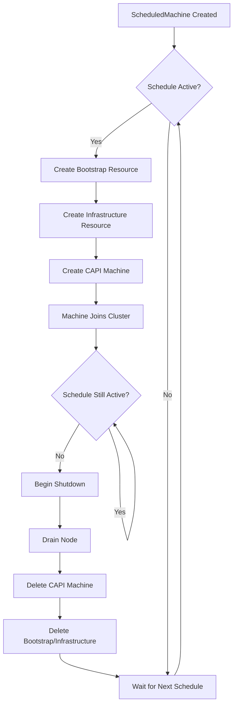

# ScheduledMachine

The `ScheduledMachine` Custom Resource Definition (CRD) is the primary API for 5-Spot.

## Overview

A ScheduledMachine defines:

- When a machine should be active (schedule)
- Inline bootstrap and infrastructure specs (CAPI resources created on-demand)
- Lifecycle behavior (priority, grace period, kill switch)

## Example

```yaml
apiVersion: 5spot.finos.org/v1alpha1
kind: ScheduledMachine
metadata:
  name: business-hours-worker
  namespace: default
spec:
  schedule:
    daysOfWeek:
      - mon-fri
    hoursOfDay:
      - 9-17
    timezone: America/New_York
    enabled: true
  
  # Inline bootstrap configuration
  bootstrapSpec:
    apiVersion: bootstrap.cluster.x-k8s.io/v1beta1
    kind: K0sWorkerConfig
    spec:
      version: v1.30.0+k0s.0
  
  # Inline infrastructure configuration
  infrastructureSpec:
    apiVersion: infrastructure.cluster.x-k8s.io/v1beta1
    kind: RemoteMachine
    spec:
      address: 192.168.1.100
      port: 22
      user: admin
      useSudo: true
  
  clusterName: production-cluster
  priority: 50
  gracefulShutdownTimeout: 5m
  nodeDrainTimeout: 5m
  killSwitch: false
```

## Spec Fields

### schedule

Defines when the machine should be active using day and hour ranges.

| Field | Type | Required | Default | Description |
|-------|------|----------|---------|-------------|
| `daysOfWeek` | `[]string` | No* | `[]` | Days when active. Supports ranges and lists. |
| `hoursOfDay` | `[]string` | No* | `[]` | Hours when active (0-23). Supports ranges. |
| `timezone` | `string` | No | `UTC` | IANA timezone for schedule evaluation. |
| `enabled` | `bool` | No | `true` | Whether the schedule is enabled. |

*At least one of `daysOfWeek` or `hoursOfDay` must be non-empty.

#### Day Format

- Single day: `mon`, `tue`, `wed`, `thu`, `fri`, `sat`, `sun`
- Range: `mon-fri`, `sat-sun`
- Mixed: `mon-wed,fri`

#### Hour Format

- Single hour: `9`, `14`, `22`
- Range: `9-17` (inclusive of both start and end)
- Mixed: `0-9,17-23`

### bootstrapSpec

Inline bootstrap configuration spec. This resource is created when the schedule is active.

| Field | Type | Required | Description |
|-------|------|----------|-------------|
| `apiVersion` | `string` | Yes | API version (e.g., `bootstrap.cluster.x-k8s.io/v1beta1`) |
| `kind` | `string` | Yes | Kind of bootstrap resource (e.g., `K0sWorkerConfig`) |
| `namespace` | `string` | No | Namespace for created resource (defaults to ScheduledMachine namespace) |
| `spec` | `object` | Yes | Provider-specific spec (e.g., K0sWorkerConfig spec) |

### infrastructureSpec

Inline infrastructure configuration spec. This resource is created when the schedule is active.

| Field | Type | Required | Description |
|-------|------|----------|-------------|
| `apiVersion` | `string` | Yes | API version (e.g., `infrastructure.cluster.x-k8s.io/v1beta1`) |
| `kind` | `string` | Yes | Kind of infrastructure resource (e.g., `RemoteMachine`) |
| `namespace` | `string` | No | Namespace for created resource (defaults to ScheduledMachine namespace) |
| `spec` | `object` | Yes | Provider-specific spec (e.g., RemoteMachine spec) |

### machineTemplate (Optional)

Optional configuration applied to the created CAPI Machine.

| Field | Type | Required | Default | Description |
|-------|------|----------|---------|-------------|
| `labels` | `map[string]string` | No | `{}` | Labels to apply to the created Machine |
| `annotations` | `map[string]string` | No | `{}` | Annotations to apply to the created Machine |

### Other Fields

| Field | Type | Required | Default | Description |
|-------|------|----------|---------|-------------|
| `clusterName` | `string` | Yes | - | Name of the CAPI cluster. |
| `priority` | `int` | No | `50` | Priority (0-255). Higher = more important. |
| `gracefulShutdownTimeout` | `string` | No | `5m` | Time for graceful machine shutdown. |
| `nodeDrainTimeout` | `string` | No | `5m` | Timeout for draining the node before deletion. |
| `killSwitch` | `bool` | No | `false` | Operator-driven kill switch. Immediately remove machine if `true`; reset to `false` to return to scheduled service. |
| `killIfCommands` | `[]string` | No | `null` | Node-side process-match kill switch. When non-empty, the reclaim agent DaemonSet is installed on the backing node and watches `/proc` for any process whose `comm` or `cmdline` matches an entry. First match triggers `EmergencyRemove` + auto-disables the schedule. See [Emergency Reclaim](./emergency-reclaim.md). |
| `nodeTaints` | `[]NodeTaint` | No | `[]` | User-defined taints applied to the Kubernetes Node once it is Ready. The controller owns and reconciles only the taints it applied; admin-added taints on the same Node are left untouched. See [Node Taints](#node-taints) below. |
| `kata` | `KataConfig` | No | `null` | Kata containerd drop-in delivery. References a `ConfigMap`/`Secret` **on the workload cluster** whose content the node-side agent writes to the **fixed** host path `/etc/k0s/containerd.d/kata.toml` (not configurable — ADR 0005), then restarts `restartService` (default `k0sworker.service`) once per distinct content change so containerd reloads it. See [Kata Config Delivery](./kata-config-delivery.md). |

## Node Taints

`spec.nodeTaints` declares taints that must exist on the Kubernetes Node once
it joins the cluster and reports `Ready=True`. The controller patches them on
via server-side apply, tracks what it applied in `status.appliedNodeTaints`,
and reconciles drift on every Node change (event-driven via the Node watch —
no polling).

### Shape

```yaml
spec:
  nodeTaints:
    - key: workload
      value: batch
      effect: NoSchedule
    - key: dedicated
      value: ml
      effect: NoExecute
```

| Field | Type | Required | Description |
|-------|------|----------|-------------|
| `key` | `string` | Yes | RFC-1123 qualified name. Max 253 chars total; name-part ≤ 63. Reserved prefixes (`5spot.finos.org/`, `kubernetes.io/`, `node.kubernetes.io/`, `node-role.kubernetes.io/`) are rejected at admission. |
| `value` | `string` | No | Optional value, ≤ 63 chars. Mutable — changing the value on an existing taint triggers an update, not an add/remove. |
| `effect` | `enum` | Yes | One of `NoSchedule`, `PreferNoSchedule`, `NoExecute`. Identity is the tuple `(key, effect)`. |

### Ownership model

Taint identity is `(key, effect)`; the `value` is mutable. The controller only
touches taints it previously applied (tracked in `status.appliedNodeTaints` and
recorded in the annotation `5spot.finos.org/applied-taints` on the Node).

- **Admin-added taint with the same `(key, effect)`**: surfaces as a
  `TaintOwnershipConflict` condition. The controller refuses to overwrite.
- **Admin-added taint with a different `(key, effect)`**: ignored — left in
  place on the Node across reconciles.
- **Spec shrinks (taint removed)**: the controller removes only taints it
  previously applied. If the admin has mutated the value since we applied it,
  the controller refuses to remove and surfaces a conflict.

### Status condition: `NodeTainted`

| status | reason | meaning |
|--------|--------|---------|
| `Unknown` | `NoNodeYet` | `status.nodeRef` is populated but the Node object is not yet materialised in the API server. |
| `False` | `NodeNotReady` | Node exists but `Ready != True`. Will re-reconcile on the Node watch event. |
| `False` | `PatchFailed` | k8s API returned an error on the last patch. Exponential backoff applies. |
| `False` | `TaintOwnershipConflict` | An admin taint collides with a declared `(key, effect)`. The controller refuses to overwrite until the spec changes. |
| `True` | `Applied` | All declared taints are present on the Node. |

### What it does not manage

- **Tolerations** — a Pod-side concern. Workloads must declare tolerations
  themselves to schedule onto tainted Nodes.
- **Node labels** — separate feature with different conflict semantics.
- **Admin-added taints** — never removed or overwritten by the controller.

## Status Fields

The status subresource contains the current state:

| Field | Type | Description |
|-------|------|-------------|
| `phase` | `string` | Current lifecycle phase (Pending, Active, ShuttingDown, Inactive, Disabled, Terminated, EmergencyRemove, Error) |
| `message` | `string` | Human-readable status message |
| `inSchedule` | `bool` | Whether currently within scheduled window |
| `conditions` | `[]Condition` | Detailed status conditions |
| `machineRef` | `ObjectReference` | Reference to created CAPI Machine |
| `bootstrapRef` | `ObjectReference` | Reference to created bootstrap resource |
| `infrastructureRef` | `ObjectReference` | Reference to created infrastructure resource |
| `nodeRef` | `NodeRef` | Reference to the Kubernetes Node (apiVersion, kind, name, uid) once provisioned |
| `providerID` | `string` | Provider-assigned machine identifier (copied from CAPI `Machine.spec.providerID`) |
| `appliedNodeTaints` | `[]NodeTaint` | Taints the controller has applied to the Node. Source of truth for ownership — only entries here are eligible for removal. See [Node Taints](#node-taints). |
| `lastScheduledTime` | `Time` | Last time machine was created |
| `nextActivation` | `Time` | Next scheduled activation time |
| `nextCleanup` | `Time` | Time when machine will be cleaned up |
| `observedGeneration` | `int` | Last observed generation |

## How It Works



The controller:

1. Watches for `ScheduledMachine` resources
2. Evaluates schedules against current time (in configured timezone)
3. When schedule is active: creates bootstrap, infrastructure, and Machine resources
4. When schedule ends: gracefully shuts down and cleans up all created resources
5. Maintains owner references for automatic garbage collection

## Security: Provider payload pass-through

`spec.bootstrapSpec.spec` and `spec.infrastructureSpec.spec` are
**forwarded unchanged** to the named provider. 5-Spot validates the
provider name (allowlist of `bootstrap.cluster.x-k8s.io`,
`infrastructure.cluster.x-k8s.io`, and `k0smotron.io` groups) and the
envelope shape (`apiVersion`, `kind`, presence of `spec`) but
**does not inspect the inner spec**. That is by design — the controller
is provider-agnostic, and inspecting every possible provider's schema
would couple the controller to every provider's release cycle.

The trust boundary is therefore the **provider**, not 5-Spot:

- **k0smotron `K0sWorkerConfig.spec.cloudInit`** is interpreted as
  cloud-init YAML and executed verbatim on the provisioned machine. A
  user with `create scheduledmachines` can run any cloud-init payload
  on the VMs they cause to be provisioned.
- **k0smotron `RemoteMachine.spec.address`** is the SSH endpoint the
  infrastructure controller connects to. A user can point this at any
  reachable host or IP.
- **CAPA / CAPM3 / other CAPI providers** carry their own attack
  surfaces in their inline specs (image, command, env-with-secret,
  etc.).

### Implications for multi-tenant operators

If different teams self-service `ScheduledMachine` CRs in their own
namespaces, you MUST review provider documentation for fields that
grant code execution or cross-tenant reachability **before** granting
`create scheduledmachines` to a tenant. Options:

1. **Pre-stage approved bootstrap / infrastructure resources** in a
   platform-controlled namespace and expose only their `kind` + `name`
   to tenants via your own wrapper CR. This eliminates the inline spec
   entirely. (Out of scope for v1alpha1; tracked for a future
   v1alpha2.)
2. **Layer policy on top of 5-Spot**: a CEL `ValidatingAdmissionPolicy`
   can reject specific provider fields (e.g. `cloudInit`,
   `address` outside an approved CIDR) at admission time. The 5-Spot
   `ValidatingAdmissionPolicy` validates structure but does not inspect
   provider payloads — that's a complementary policy.
3. **Trust-but-verify**: scope `create` to trusted teams and audit the
   inline specs out of band.

The 5-Spot `ValidatingAdmissionPolicy` and the runtime validators in
`src/reconcilers/helpers.rs` together cover everything that 5-Spot
itself can decide is malformed (cluster name length, label prefixes,
schedule format, kill-if-commands bounds, …). They do not — and cannot
— validate provider-specific cloud-init, SSH targets, or container
images.

## Related

- [API Reference](../reference/api.md) - Complete API documentation
- [Machine Lifecycle](./machine-lifecycle.md) - Phase transitions
- [Schedules](./schedules.md) - Schedule configuration details
- [Emergency Reclaim](./emergency-reclaim.md) - `killIfCommands` and the process-match kill switch
- [CRD Attack Surface](../security/crd-attack-surface.md) - per-field validation status and downstream sinks
