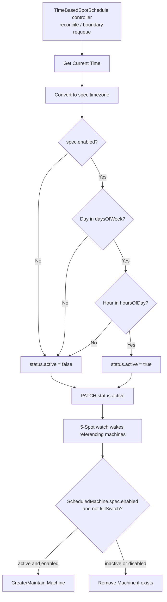

# Schedule Configuration

5-Spot uses flexible schedule configurations to determine when machines should
be active.

> **Since ADR 0009**, a `ScheduledMachine.spec.schedule` is a *reference* to a
> spot-schedule provider object — it no longer carries the day/hour window
> inline. The day/hour/timezone grammar described on this page now lives on the
> default first-party provider, **`TimeBasedSpotSchedule`** (see the
> [provider guide](../guides/time-based-schedule.md)). The grammar is unchanged;
> only its home moved. All `spec:` snippets below are `TimeBasedSpotSchedule`
> specs.

## Schedule Options

A `TimeBasedSpotSchedule` schedules machines using day and hour ranges.

## Day/Hour Range Syntax

Use `daysOfWeek` and `hoursOfDay` on a `TimeBasedSpotSchedule` to define when a
machine should be active:

```yaml
apiVersion: spotschedules.5spot.finos.org/v1alpha1
kind: TimeBasedSpotSchedule
metadata:
  name: business-hours
  namespace: default
spec:
  daysOfWeek:
    - mon-fri
  hoursOfDay:
    - 9-17
  timezone: America/New_York
  enabled: true
```

A `ScheduledMachine` then references it:

```yaml
spec:
  enabled: true
  schedule:
    apiVersion: spotschedules.5spot.finos.org/v1alpha1
    kind: TimeBasedSpotSchedule
    name: business-hours
```

## Days of Week

### Supported Values

- `mon`, `tue`, `wed`, `thu`, `fri`, `sat`, `sun`

### Range Syntax

Use a hyphen to specify ranges:

```yaml
daysOfWeek:
  - mon-fri  # Monday through Friday
```

### Multiple Ranges

Combine ranges and individual days:

```yaml
daysOfWeek:
  - mon-wed
  - fri
  - sun
```

### Wrap-Around Ranges

Ranges can wrap around the week:

```yaml
daysOfWeek:
  - fri-mon  # Friday, Saturday, Sunday, Monday
```

### Examples

| Configuration | Active Days |
|---------------|-------------|
| `[mon-fri]` | Monday - Friday |
| `[sat-sun]` | Saturday - Sunday |
| `[mon, wed, fri]` | Monday, Wednesday, Friday |
| `[mon-wed, fri-sun]` | Mon-Wed and Fri-Sun |
| `[fri-tue]` | Fri, Sat, Sun, Mon, Tue (wrap-around) |

## Hours of Day

### Format

Hours are specified in 24-hour format (0-23).

### Range Behavior

Ranges are **inclusive of both start and end**:

```yaml
hoursOfDay:
  - 9-17  # Active from 9:00 to 17:59
```

### Multiple Ranges

```yaml
hoursOfDay:
  - 0-8
  - 18-23
  # Active outside business hours
```

### Wrap-Around Ranges

Hours can wrap around midnight:

```yaml
hoursOfDay:
  - 22-6  # 10pm to 6am (overnight)
```

### Examples

| Configuration | Active Hours |
|---------------|--------------|
| `[9-17]` | 9:00 AM - 5:59 PM |
| `[0-23]` | All day (24 hours) |
| `[0-8, 18-23]` | Night shift |
| `[6-12, 14-20]` | Two shifts with lunch break |
| `[22-6]` | Overnight (10pm - 6am) |

## Timezone

### IANA Timezone Names

Use standard IANA timezone names:

```yaml
timezone: America/New_York
timezone: Europe/London
timezone: Asia/Tokyo
timezone: UTC
```

### Common Timezones

| Timezone | UTC Offset | Region |
|----------|------------|--------|
| `UTC` | +00:00 | Universal |
| `America/New_York` | -05:00 | US Eastern |
| `America/Los_Angeles` | -08:00 | US Pacific |
| `Europe/London` | +00:00 | UK |
| `Europe/Paris` | +01:00 | Central Europe |
| `Asia/Tokyo` | +09:00 | Japan |

### Daylight Saving Time

Timezones automatically handle DST transitions:

- `America/New_York` adjusts for EDT/EST
- `Europe/London` adjusts for BST/GMT

## Enabled Flag

There are two distinct `enabled` switches — keep them separate:

- **`TimeBasedSpotSchedule.spec.enabled`** (the provider's own toggle): set
  `false` to force the provider's `status.active` to `false` (the window is
  ignored) without deleting the schedule. Every `ScheduledMachine` referencing
  it then sees an inactive provider.
- **`ScheduledMachine.spec.enabled`** (the administrative master switch): set
  `false` to hold *that one machine* in the `Disabled` phase regardless of what
  its provider reports. This is also the loop-breaker the emergency-reclaim flow
  sets.

### Disabling a provider window

```yaml
apiVersion: spotschedules.5spot.finos.org/v1alpha1
kind: TimeBasedSpotSchedule
spec:
  enabled: false
  # ... daysOfWeek / hoursOfDay / timezone preserved
```

When the provider is disabled (`status.active: false`):

- Existing active machines that reference it gracefully shut down
- No new activations occur

Set `ScheduledMachine.spec.enabled: false` instead to administratively park a
single machine in the `Disabled` phase.

### Use Cases

- **Maintenance windows**: Temporarily disable scheduling
- **Emergency situations**: Quick pause without config changes
- **Testing**: Disable specific machines during tests

## Common Schedule Patterns

### Business Hours (Mon-Fri, 9-5)

```yaml
schedule:
  daysOfWeek: [mon-fri]
  hoursOfDay: [9-17]
  timezone: America/New_York
```

### 24/7 Operation

```yaml
schedule:
  daysOfWeek: [mon-sun]
  hoursOfDay: [0-23]
  timezone: UTC
```

### Night Shift

```yaml
# Wrap-around hour ranges are supported
schedule:
  daysOfWeek: [mon-fri]
  hoursOfDay: [18-23, 0-6]
  timezone: UTC
```

### Weekend Only

```yaml
schedule:
  daysOfWeek: [sat-sun]
  hoursOfDay: [0-23]
  timezone: UTC
```

### Peak Hours Only

```yaml
schedule:
  daysOfWeek: [mon-fri]
  hoursOfDay: [8-10, 16-18]
  timezone: America/Los_Angeles
```

## Schedule Evaluation

Evaluation is **event-driven**, split across two controllers (ADR 0009). The
`TimeBasedSpotSchedule` provider controller computes `status.active` from the
window and **requeues once at the next window boundary** (no polling). 5-Spot's
main controller **watches** the referenced provider and reacts to its
`status.active` flips at watch latency.



## Related

- [ScheduledMachine](./scheduled-machine.md) - CRD specification
- [Machine Lifecycle](./machine-lifecycle.md) - Phase transitions
- [API Reference](../reference/api.md) - Complete API documentation
