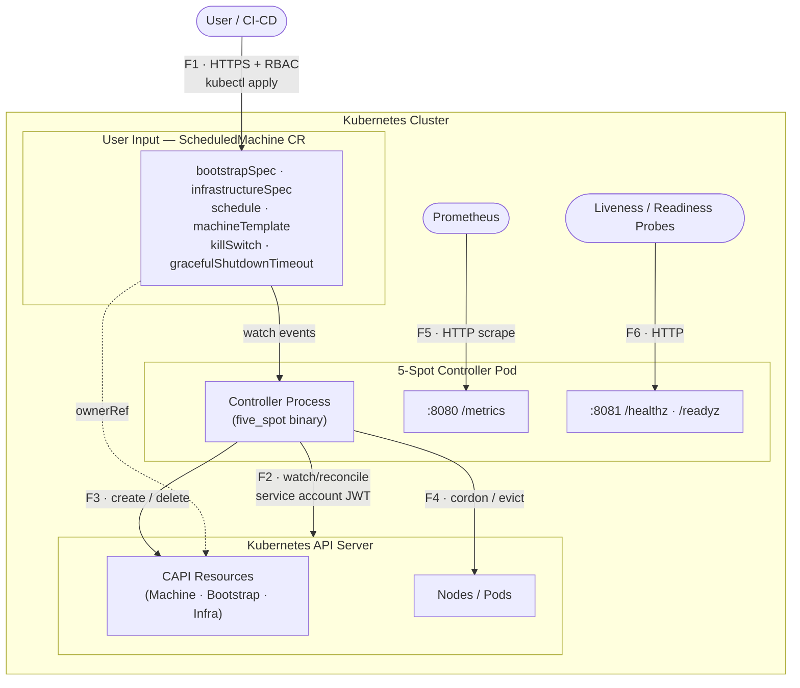
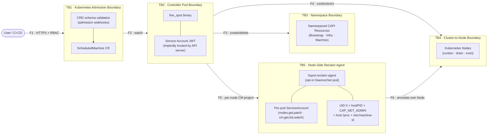

# Threat Model: 5-Spot ScheduledMachine Controller

**Version:** 1.0  
**Date:** 2026-04-08  
**Status:** Active  
**Classification:** Internal — Security Sensitive

---

## 1. Document Scope

This threat model covers the **5-Spot controller** — a Kubernetes operator that manages the lifecycle of physical machines in k0smotron-backed CAPI clusters based on configurable time schedules.

It identifies assets, trust boundaries, threat actors, per-component STRIDE threats, current mitigations, and residual risk. It is intended to inform security reviews, deployment hardening decisions, and future development.

**In scope:**
- The controller process (`five_spot` binary) and its Kubernetes RBAC surface
- The `ScheduledMachine` Custom Resource Definition and its admission path
- All Kubernetes API interactions (CAPI Machine, Bootstrap, Infrastructure, Nodes, Pods)
- The metrics (`/metrics`) and health (`/healthz`, `/readyz`) HTTP endpoints

**Out of scope:**
- The underlying k0smotron / CAPI infrastructure providers
- The physical machines being managed
- The Kubernetes API server itself
- Network-level threats (CNI, firewall policy)

---

## 2. System Overview



### Key Data Flows

| Flow | Description | Protocol | Auth |
|---|---|---|---|
| F1 | User → API Server: create/update ScheduledMachine | HTTPS | Kubernetes RBAC |
| F2 | Controller → API Server: watch ScheduledMachine events | HTTPS/Watch | Service account JWT |
| F3 | Controller → API Server: create/delete CAPI resources | HTTPS | Service account JWT |
| F4 | Controller → API Server: cordon Node, evict Pods | HTTPS | Service account JWT |
| F5 | Prometheus → Controller: scrape metrics | HTTP (no TLS) | None (cluster-internal) |
| F6 | Kubernetes probes → Controller: health checks | HTTP (no TLS) | None (cluster-internal) |

---

## 3. Assets

| Asset | Sensitivity | Description |
|---|---|---|
| **Physical machine availability** | Critical | Machines being added/removed from cluster; unintended removal causes workload disruption |
| **CAPI cluster integrity** | Critical | Bootstrap and infrastructure resources that define cluster membership |
| **Node workloads** | High | Running pods that could be evicted during a drain operation |
| **Controller service account credentials** | High | JWT token granting cluster-wide RBAC privileges |
| **ScheduledMachine spec data** | Medium | Contains infrastructure topology (addresses, ports, SSH config) |
| **Kubernetes RBAC posture** | High | Overly broad permissions on the service account expand blast radius of compromise |
| **Cluster-wide node state** | High | Cordon/drain operations affect all workloads on targeted nodes |

---

## 4. Trust Boundaries



---

## 5. Threat Actors

| Actor | Capability | Motivation |
|---|---|---|
| **Malicious tenant** | Can create/edit ScheduledMachines in their namespace | Escape namespace, disrupt other tenants, exfiltrate data |
| **Compromised CI/CD** | Can push images or apply manifests | Backdoor controller binary, escalate privileges |
| **Compromised controller pod** | Has the controller's service account | Lateral movement to CAPI resources, node disruption |
| **Rogue operator** | Internal user with broad kubectl access | Misuse kill switch, drain nodes during business hours |
| **Supply chain attacker** | Can inject into upstream crates (kube-rs, serde, etc.) | RCE inside controller, credential theft |

---

## 6. STRIDE Threat Analysis

### 6.1 ScheduledMachine Custom Resource (Trust Boundary: TB1)

#### Spoofing
| ID | Threat | Likelihood | Impact | Status |
|---|---|---|---|---|
| S1 | User crafts a ScheduledMachine that mimics another tenant's resource name to confuse monitoring/alerting | Low | Low | Accepted — names are unique within namespace |
| S2 | Attacker spoofs `ownerReference` UID to claim ownership of existing resources | Low | Medium | Mitigated — UID is set server-side by the controller, not from user input |

#### Tampering
| ID | Threat | Likelihood | Impact | Status |
|---|---|---|---|---|
| T1 | **Cross-namespace resource creation** — user sets `bootstrapSpec.metadata.namespace` to `kube-system` | High | Critical | **Mitigated (2026-04-08, hardened 2026-05-30)** — controller always uses the SM's own namespace; `metadata.namespace`/`metadata.name` are now **loudly rejected** at admission (VAP rules 13c–13f) and at reconcile (`validate_embedded_metadata()`). Only `metadata.labels`/`metadata.annotations` are accepted, reserved-prefix-checked |
| T2 | **Label injection** — user sets `machineTemplate.labels["cluster.x-k8s.io/cluster-name"]` to redirect machine to attacker-controlled cluster | High | Critical | **Mitigated (2026-04-08)** — `validate_labels()` blocks reserved prefixes |
| T3 | **Annotation injection** — user injects `kubectl.kubernetes.io/restartedAt` to trigger rolling restarts | Medium | Medium | **Mitigated (2026-04-08)** — same prefix allowlist |
| T4 | **apiVersion/kind injection** — user sets `bootstrapSpec.kind: ClusterRole` to create RBAC resources | High | High | **Mitigated (2026-04-08)** — `validate_api_group()` enforces allowlist |
| T5 | User injects malicious content into `bootstrapSpec.spec` or `infrastructureSpec.spec` targeting provider vulnerabilities | Medium | High | **Partially mitigated** — spec content is passed opaquely to providers; provider-side validation is out of scope |
| T6 | **Timezone log injection** — user injects newlines/control chars into timezone field to poison structured logs | Low | Low | **Mitigated (2026-04-08)** — CRD schema enforces `pattern: ^[A-Za-z][A-Za-z0-9_+\-/]*$` and `maxLength: 64` |
| T7 | **Duration overflow** — user sets `gracefulShutdownTimeout: "9999999999999h"` causing integer overflow | Medium | High | **Mitigated (2026-04-08)** — `checked_mul` + `MAX_DURATION_SECS = 86400` cap |
| T8 | User updates ScheduledMachine spec after machine is active, changing `clusterName` mid-lifecycle | Medium | Medium | **Residual risk** — spec changes trigger reconciliation; no immutability enforcement on `clusterName` |

#### Repudiation
| ID | Threat | Likelihood | Impact | Status |
|---|---|---|---|---|
| R1 | No audit trail when kill switch is activated | Medium | High | **Residual risk** — Kubernetes audit log captures the CR edit, but controller logs only emit a single line; no structured event emitted |
| R2 | No record of which schedule window caused machine removal | Low | Low | Accepted — status conditions record transition timestamps |

#### Information Disclosure
| ID | Threat | Likelihood | Impact | Status |
|---|---|---|---|---|
| I1 | Error messages in `ReconcilerError` echo user-provided values (timezone, duration, API groups) verbatim | Low | Low | **Residual risk** — these are operator-visible logs, not exposed to end users; impact limited |
| I2 | `bootstrapSpec.spec` may contain infrastructure addresses, credentials, or SSH keys in plaintext | High | High | **Residual risk** — see Section 8 |
| I3 | ScheduledMachine status exposes `nodeRef`, `machineRef` — leaks infrastructure topology to namespace readers | Low | Low | Accepted — intentional observability; readers in the same namespace are trusted |

#### Denial of Service
| ID | Threat | Likelihood | Impact | Status |
|---|---|---|---|---|
| D1 | Attacker creates thousands of ScheduledMachines to overwhelm the controller reconciliation queue | Medium | Medium | **Partially mitigated** — Kubernetes resource quotas and admission webhooks can cap CR count; controller has CPU/memory limits |
| D2 | **Finalizer hang** — drain operation never completes, blocking namespace deletion indefinitely | Medium | High | **Mitigated (2026-04-08)** — `tokio::time::timeout(600s)` wraps finalizer cleanup |
| D3 | Attacker crafts extremely long `daysOfWeek`/`hoursOfDay` arrays to slow admission validation | Low | Low | **Mitigated** — admission policy validates each item individually; Kubernetes limits CR size |
| D4 | User triggers kill switch repeatedly causing rapid machine add/remove cycles (thrashing) | Low | Medium | Accepted — kill switch is write-once-by-design; no automatic reactivation |

#### Elevation of Privilege
| ID | Threat | Likelihood | Impact | Status |
|---|---|---|---|---|
| E1 | Attacker uses `apiVersion: rbac.authorization.k8s.io/v1, kind: ClusterRole` to create RBAC resources via controller | High | Critical | **Mitigated (2026-04-08)** — API group allowlist |
| E1a | **Escalation through the controller** — user who can create a `ScheduledMachine` but **not** the embedded bootstrap/infrastructure resource has the broadly-permissioned controller create it on their behalf | High | High | **Mitigated (2026-05-29)** — VAP `authorizer` rules (13a/13b) require the *requesting user* to hold `create` on the embedded GVKs; controller's own SA independently gated at reconcile by `ensure_can_create()` (`SelfSubjectAccessReview`) |
| E2 | **Compromised controller pod** gains cluster-wide node cordon/drain, CAPI write access | Medium | Critical | **Partially mitigated** — k0smotron.io RBAC narrowed; bootstrap/infra still use wildcards (provider-agnostic requirement) |
| E3 | Controller service account token stolen from pod filesystem | Low | Critical | **Mitigated** — read-only root filesystem; token mounted at standard path (Kubernetes default); no projected service account with long lifetime |

---

### 6.2 Controller Process (Trust Boundary: TB2)

#### Spoofing
| ID | Threat | Likelihood | Impact | Status |
|---|---|---|---|---|
| S3 | Attacker replaces controller image with backdoored binary | Low | Critical | **Residual risk** — mitigated by image signing (release workflow uses Cosign); `IfNotPresent` pull policy means in-cluster image is trusted |

#### Tampering
| ID | Threat | Likelihood | Impact | Status |
|---|---|---|---|---|
| T9 | Memory corruption in unsafe Rust code or via malformed serde input | Very Low | Critical | **Mitigated** — codebase is safe Rust; no `unsafe` blocks; serde handles malformed input with errors |
| T10 | Supply chain attack via malicious crate version | Low | Critical | **Residual risk** — mitigated by Grype container scan (VEX-aware) in CI; no automated dependency pinning beyond Cargo.lock |

#### Information Disclosure
| ID | Threat | Likelihood | Impact | Status |
|---|---|---|---|---|
| I4 | `/metrics` endpoint accessible without authentication | Medium | Low | Accepted — metrics contain no secrets; exposes operational data only; restricted to cluster network |
| I5 | Service account token exposed via `RUST_LOG=trace` debug output | Low | Medium | **Residual risk** — `RUST_LOG=debug` set in deployment; kube-rs does not log JWT tokens; verify before production |

#### Denial of Service
| ID | Threat | Likelihood | Impact | Status |
|---|---|---|---|---|
| D5 | Pod eviction during drain exhausts Kubernetes API rate limits (`429` responses from PDB) | Medium | Medium | **Mitigated** — `evict_pod` handles 429 gracefully and logs a warning rather than crashing |

---

### 6.3 Node Drain Path (Trust Boundary: TB4)

#### Tampering
| ID | Threat | Likelihood | Impact | Status |
|---|---|---|---|---|
| T11 | Attacker creates ScheduledMachine whose `clusterName` matches a production cluster, triggering drain of production nodes outside schedule | Medium | Critical | **Partially mitigated** — `clusterName` is used only as a label on the created CAPI Machine; actual drain targets the node resolved via the Machine's `nodeRef` |

#### Denial of Service
| ID | Threat | Likelihood | Impact | Status |
|---|---|---|---|---|
| D6 | Grace period expires mid-drain; pods are forcefully killed without completing shutdown hooks | Medium | Medium | Accepted — `POD_EVICTION_GRACE_PERIOD_SECS = 30` is configurable via constant; PDB protection applies |
| D7 | `Api::all()` for Nodes/Pods fetches cluster-wide list; maliciously large cluster could cause memory spike | Low | Low | Accepted — field selector `spec.nodeName=<node>` scopes pod list to one node |

---

### 6.4 Reclaim Agent (Trust Boundary: TB5)

The node-side `5spot-reclaim-agent` DaemonSet runs on opted-in
worker nodes only and signals the controller via three Node
annotations. It is the lowest-trust component in the system: pod
runs as UID 0 with `hostPID: true`, host `/proc` mount, host
`/etc/machine-id` mount, and `CAP_NET_ADMIN` (for rung 2 netlink
proc connector). Per-pod `ServiceAccount` grants only
`nodes: get,patch` cluster-wide and `configmaps: get,list,watch`
in `5spot-system`.

#### Spoofing
| ID | Threat | Likelihood | Impact | Status |
|---|---|---|---|---|
| S5 | Attacker with `update daemonsets` overrides the agent pod's `NODE_NAME` env var, causing the agent to PATCH reclaim annotations on a victim Node it isn't actually running on | Low (precondition is cluster-admin-equivalent in most clusters) | High (would trigger emergency-remove on innocent host) | **Mitigated** — host-identity verification (`read_host_machine_id` + `compare_machine_ids`, security-audit Phase 4, 2026-04-26): agent reads `/etc/machine-id` from a `hostPath.type: File` mount at startup and refuses to PATCH a Node whose `status.nodeInfo.machineID` doesn't match. `--skip-host-id-check` opt-out exists but defaults off. |
| S6 | Compromised pod somewhere else in the cluster spoofs the reclaim annotations directly on a Node, triggering an emergency-remove the agent never decided on | Low | High | **Partially mitigated** — `nodes: patch` is broadly held in most clusters (kubelet itself has it); the controller treats the annotation as authoritative. Mitigation: monitor `5spot.finos.org/reclaim-requested` PATCH events via API audit logs, alert when the field manager is anything other than `5spot-reclaim-agent`. |

#### Tampering
| ID | Threat | Likelihood | Impact | Status |
|---|---|---|---|---|
| T12 | Compromised agent escalates to other Nodes via stolen ServiceAccount token | Low (per-pod SA, scoped credentials) | Medium | **Mitigated** — RBAC: `nodes: get,patch` cluster-wide (no `list/watch` — can't enumerate). Host-identity check refuses any PATCH against a Node whose `machineID` doesn't match the agent's own `/etc/machine-id`. |
| T13 | `CAP_NET_ADMIN` (granted for rung 2 netlink) is misused to send rogue netlink messages on other subsystems | Low | Low–Medium | **Accepted** — `CAP_NET_ADMIN` is Linux's coarsest-grained networking cap and grants more than just netlink connector access (route table edits, iptables, etc.). Scope-bounded in two ways: (1) the cap is added only on opted-in Nodes via the existing `5spot.finos.org/reclaim-agent: enabled` nodeSelector, so only the small set of Nodes with `killIfCommands` set ever sees it; (2) the agent binary is single-purpose with no shell, no exec of children — a compromise would need an attacker to swap the binary, at which point they could grant themselves any cap they wanted. Operators who refuse the cap can pin `--detector=poll` (rung 1) which needs no extra capability. |

#### Repudiation
| ID | Threat | Likelihood | Impact | Status |
|---|---|---|---|---|
| R1 | Agent PATCH on the Node is indistinguishable from controller writes in audit logs | Low | Low | **Mitigated** — the agent uses field manager `5spot-reclaim-agent`; the controller uses the distinct field manager `5spot-controller-reclaim-agent`. Every Node PATCH carries the field manager in `managedFields`, so audit attribution is unambiguous (NIST AU-2 / AU-10). |

#### Information Disclosure
| ID | Threat | Likelihood | Impact | Status |
|---|---|---|---|---|
| I3 | Reading host `/proc/<pid>/cmdline` for matching exposes argv strings (which can include passwords / tokens passed on the command line) to the agent's logs | Low (logs are operator-owned) | Low | **Accepted** — the agent logs `matched_pattern` (the operator-supplied pattern) and the matched pid, NOT the full cmdline. Patterns themselves are operator-authored config, not user input. |

#### Denial of Service
| ID | Threat | Likelihood | Impact | Status |
|---|---|---|---|---|
| D8 | User repeatedly re-enables a SM whose conflicting process is still running, generating an ejection loop | Medium | Low | **Mitigated** — loop-protection: ≥3 reclaims for the same SM within 10 minutes emits a `RapidReReclaim` Warning Event and bumps `fivespot_rapid_re_reclaims_total{namespace, name}`. Operator runbook in [troubleshooting](../operations/troubleshooting.md) covers the response. |
| D9 | Heavy-exec workload (`make -j32`) overwhelms the netlink subscriber's recv loop with `PROC_EVENT_EXEC` traffic | Low | Low | **Accepted** — agent CPU is bounded by container limits (`50m`); `ENOBUFS` on the netlink socket surfaces as `NetlinkError::Io` and is logged, not silently dropped. Operators who anticipate exec storms should pin `--detector=poll`. |

#### Elevation of Privilege
| ID | Threat | Likelihood | Impact | Status |
|---|---|---|---|---|
| E4 | `hostPID: true` lets the agent see all host PIDs — could be abused to extract data from another container's `/proc/<pid>/environ` if the agent is compromised | Low | Medium | **Accepted** — `hostPID` is architecturally required (the agent's job is to read host process state). Mitigated by: opt-in `nodeSelector` (only on nodes with `killIfCommands`), single-purpose binary with no shell, `readOnlyRootFilesystem: true`, drop ALL caps + add only `NET_ADMIN`, `seccompProfile: RuntimeDefault`. Trivy / Semgrep suppressions in `.trivyignore` document the architectural-necessity reasoning. |
| E5 | **Abuse of the namespace-wide pod-security exemption** — the privileged agents require `5spot-system` to be exempted from the cluster's PSA/Gatekeeper/Kyverno baseline; any principal with `create pods` in the namespace (compromised CI, typo'd Deployment) could then run privileged / mount the host root with no admission check | Medium | Critical | **Mitigated (2026-06-10, ADR 0004)** — `5spot-agent-pod-security` deny-by-default `ValidatingAdmissionPolicy` re-imposes the baseline inside `5spot-system`: risky attributes pinned to the two agent ServiceAccounts at their exact documented posture (hostPath clamped per agent, caps clamped to `NET_ADMIN`, `privileged` to the kata agent only), compensating controls mandatory, `hostNetwork`/`hostIPC` and risky ephemeral containers denied outright, `failurePolicy: Fail`. Residual: a principal who can both create pods *and* use an agent SA wears the exception — clamped to the agents' documented posture; SA RBAC is the control. |

---

## 7. Mitigations Summary

### Implemented (as of 2026-04-08)

| Control | Where | Addresses |
|---|---|---|
| `EmbeddedResource.namespace` field removed | `src/crd.rs` | T1 — cross-namespace creation |
| `validate_api_group()` allowlist | `src/reconcilers/helpers.rs` | T4, E1 — kind/apiVersion injection |
| `validate_labels()` reserved prefix rejection | `src/reconcilers/helpers.rs` | T2, T3 — label/annotation injection |
| `checked_mul` + `MAX_DURATION_SECS` cap | `src/reconcilers/helpers.rs` | T7 — duration overflow |
| Timezone `maxLength` + character pattern in CRD | `src/crd.rs` | T6 — log injection |
| `tokio::time::timeout(600s)` in finalizer cleanup | `src/reconcilers/helpers.rs` | D2 — finalizer hang |
| k0smotron.io RBAC narrowed to explicit resources | `deploy/deployment/rbac/clusterrole.yaml` | E2 — over-privileged SA |
| Non-root container, read-only root filesystem, all caps dropped | `deploy/deployment/deployment.yaml` | E3 — token theft |
| CPU/memory resource limits | `deploy/deployment/deployment.yaml` | D1 — resource exhaustion |
| PDB 429 handling in `evict_pod` | `src/reconcilers/helpers.rs` | D5 — API rate limit crash |
| Cosign image signing in release CI | `.github/workflows/release.yaml` | S3 — image tampering |
| Host-identity verification (machine-id cross-check) | `src/reclaim_agent.rs::compare_machine_ids` + `deploy/node-agent/daemonset.yaml` (`/etc/machine-id` mount) | S5 — DaemonSet-tampering NODE_NAME spoof |
| Distinct field managers (`5spot-reclaim-agent` vs `5spot-controller-reclaim-agent`) | All Node PATCH paths | R1 — audit attribution |
| Per-pod `ServiceAccount` with `nodes: get,patch` only (no `list/watch`) | `deploy/node-agent/rbac.yaml` | T12 — agent enumerates other Nodes |
| Opt-in `5spot.finos.org/reclaim-agent: enabled` nodeSelector | `deploy/node-agent/daemonset.yaml` | T13 — `CAP_NET_ADMIN` scope-bounding |
| Loop-protection (`RapidReReclaim` warning + counter) | `src/loop_protection.rs` + `src/reconcilers/helpers.rs::handle_emergency_remove` | D8 — re-enable loop |
| Agent pod-security exception boundary (`5spot-agent-pod-security` VAP, deny-by-default in `5spot-system`) | `deploy/admission/agent-pod-security-policy.yaml` + binding (ADR 0004) | E5 — abuse of the namespace-wide PSA/OPA/Kyverno exemption the privileged agents require |

### Deployment-Layer Controls (operator responsibility)

| Control | Recommendation |
|---|---|
| Kubernetes ResourceQuota | Limit `ScheduledMachine` count per namespace (e.g., max 50) |
| `ValidatingAdmissionPolicy` ✅ deployed 2026-04-08 | Validates `bootstrapSpec.apiVersion`, `infrastructureSpec.apiVersion`, `kind` fields, duration format, and day/hour item format at admission time — see `deploy/admission/` |
| NetworkPolicy | Restrict controller pod egress to Kubernetes API server only |
| Audit logging | Enable API server audit log at `RequestResponse` level for `scheduledmachines` resources |
| RBAC for SM creation | Only grant `create` on `scheduledmachines` to trusted identities; do not grant to end users directly |
| Secrets for bootstrap data | Move sensitive bootstrap config out of CR spec into Secrets; reference from spec |

---

## 8. Residual Risks

### HIGH — Sensitive data in `bootstrapSpec.spec`

**Threat:** `EmbeddedResource.spec` is an arbitrary JSON object with `x-kubernetes-preserve-unknown-fields: true`. It may contain SSH keys, IP addresses, tokens, or other credentials stored in plaintext in etcd and visible to anyone with `get scheduledmachines` access.

**Recommendation:** Introduce a `secretRef` field alongside `spec` that references a Secret, and merge the Secret's data at runtime inside the controller. This keeps credentials out of the CR and benefits from Kubernetes secret encryption-at-rest.

**Workaround (now):** Restrict `get/list` on `scheduledmachines` to the owning service account and cluster admins only.

---

### HIGH — Bootstrap/Infrastructure RBAC wildcards

**Threat:** `bootstrap.cluster.x-k8s.io` and `infrastructure.cluster.x-k8s.io` still use `resources: ["*"]` in the ClusterRole because the controller is designed to be provider-agnostic. A compromised controller can create any bootstrap or infrastructure resource cluster-wide.

**Recommendation:** For deployments targeting a single known provider, replace wildcards with explicit resource lists (e.g., `k0sworkerconfigs` only). Document this in the operator deployment guide.

---

### MEDIUM — `clusterName` immutability

**Threat:** A user can update `spec.clusterName` on an active ScheduledMachine. The controller will reconcile with the new cluster name, potentially creating CAPI resources in a different cluster while leaving orphaned resources in the original cluster.

**Recommendation:** Use a CEL validation rule (`x-kubernetes-validations`) to make `clusterName` immutable after creation:
```yaml
x-kubernetes-validations:
  - rule: "self == oldSelf"
    message: "clusterName is immutable"
```

---


### LOW — Kill switch audit trail

**Threat:** Activating `spec.killSwitch: true` immediately removes a machine. The only record is the Kubernetes API audit log (if enabled). No Kubernetes Event is emitted by the controller.

**Recommendation:** Emit a Kubernetes Event with `reason: KillSwitchActivated` and `type: Warning` when the kill switch fires, so it appears in `kubectl describe scheduledmachine` and feeds into alerting pipelines.

---

### LOW — Multi-instance hash distribution weakness

**Threat:** The consistent hash function adds `priority * 1000` to a 64-bit hash, which provides negligible differentiation. High-priority resources may cluster on one instance.

**Recommendation:** Use a proper consistent hash ring (e.g., rendezvous hashing) when HA multi-instance support is hardened.

---

## 9. Security Assumptions

The following conditions are assumed to be true for this threat model to hold:

1. **Kubernetes API server is trusted** — requests to the API server are authenticated and authorized; no API server vulnerabilities are in scope.
2. **etcd encryption at rest is enabled** — CR specs (which may contain infrastructure details) are encrypted in etcd.
3. **RBAC for ScheduledMachine creation is restricted** — only trusted users/service accounts have `create` permission on `scheduledmachines`.
4. **Container image integrity** — the controller image is pulled from a trusted registry; image signing is enforced.
5. **Cluster network is trusted** — the metrics and health endpoints are not accessible from outside the cluster.
6. **Node-level isolation** — physical machines managed by 5-Spot do not share sensitive workloads with other tenants.

---

## 10. Related Documents

- [Architecture](../concepts/architecture.md)
- [Machine Lifecycle](../concepts/machine-lifecycle.md)
- [RBAC Configuration](../../deploy/deployment/rbac/clusterrole.yaml)
- [API Reference](../reference/api.md)
